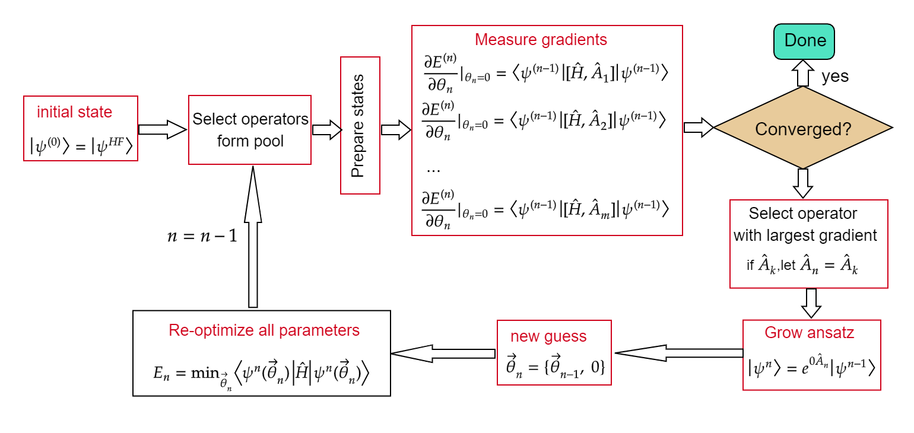

# 																	
ADAPT        VQE 

## 1. Introduction

​	Unitary coupled cluster ansatz (UCCSD), a chemically inspired ansatz, is suffered from the quantum resource that grows with the size of simulated models  and thus not suitable for most quantum hardware.

​	Can we only choose the excitation operators that help to lower the expectation energy ? The answer is yes.  Circuit depth can be reduced compared with original UCCSD ansatz in this way. To be  more concrete, ADAPT VQE only grow the ansatz by one excitation operator with the largest gradient for each step.

## 2. Operator Pool

​	The operator pool is constructed by operators in the UCCSD or UCCGSD ansatz.

​	Spin complemented operators:

​	for example: H2(4 spin orbital)

​	single operator:

​	$-0.5\hat{a}_0^\dagger\hat{a}_2 + 	-0.5\hat{a}_1^\dagger\hat{a}_3 + 0.5\hat{a}_0^\dagger\hat{a}_2+0.5\hat{a}_3^\dagger\hat{a}_1$

​	double operator:

​	$-\frac{1}{\sqrt{2}}\hat{a}_1^\dagger\hat{a}_0^\dagger\hat{a}_2\hat{a}_3+\frac{1}{\sqrt{2}}\hat{a}_3^\dagger\hat{a}_2^\dagger\hat{a}_1\hat{a}_0$

## 3. Pipeline

**Flow:**

1. On classical hardware, compute one- and two-electron integrals, and transform the fermionic Hamiltonian into a qubit representation using an appropriate transformation: Jordan-Wigner, Bravyi-Kitaev. etc.

2.  Define an "Operator Pool". This is simply a collection of operator definitions which will be used to construct the ansatz.  The set of all unique spin-complemented one- and two- body operators   are  considered in ADAPT VQE.

3. Initialize qubits to an appropriate reference state, ideally one with the correct number of electrons such as the HF (Hartree-Fock) state.

4. Measure the commutator of the Hamiltonian with each operator in the pool to get the gradient.

5. If the norm of the gradient vector is smaller than some threshold, $\varepsilon$​, exit.

6. Identify the operator with the largest gradient and add this single operator to the ansatz with a new variational

   parameter.

7. Perform a VQE experiment to re-optimize all parameters in the ansatz.

8. Go to step 4.

NOTE:

1. The gradient of each operator in the pool can also be approximated by the parameter shift rule.

   $\frac{\partial E^{(n)}}{\partial\theta_n}|_{\theta_n=0}\approx\frac{E^{(n)}(\vec{\theta}_{i-1}, \theta_n=\delta)-E^{(n)}(\vec{\theta}_{i-1}, \theta_n=-\delta)}{2\delta}$, where $E^{(n)}(\vec{\theta}_{i-1}, \theta_n=\delta)=\langle \psi^{(n-1)}|e^{-\delta\hat{A}_i}\hat{H}e^{\delta\hat{A}_i}|\psi^{(n-1)}\rangle$. ($\delta=1e-5$)

2. The convergence condition is set as

   $\sqrt{\sum_{\hat{A}_i \in pool} \langle \psi^{(n-1)}|[\hat{H},\hat{A}_i]|\psi^{(n-1)}\rangle} \le \varepsilon$, and $\varepsilon = 1e-2$

## 4. Reference

​	origin paper: [An adaptive variational algorithm for exact molecular simulations on a quantum computer](https://doi.org/10.1038/s41467-019-10988-2 | www.nature.com/naturecommunications)

​	code available: [source code]([mayhallgroup/adapt-vqe: ADAPT-VQE simulation code (github.com)](https://github.com/mayhallgroup/adapt-vqe))

