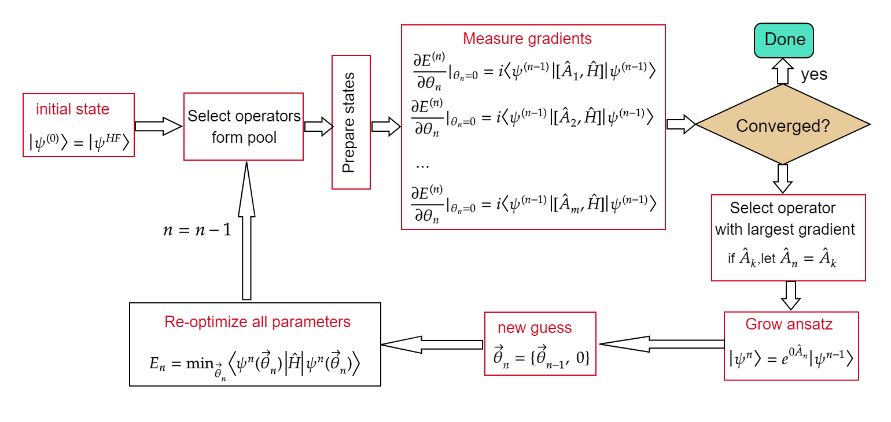

# 
qubit-ADAPT-VQE

## 1.Introduction

​	Similar to ADAPT VQE method, qubit-ADAPT-VQE construct ansatz with pauli string exponentials  rather than fermionic operators.  Typically this method can reduce quantum gates at the cost of more iterations. 

## 2.qubit pool

​	First generate the corresponding pool of ADAPT VQE. Then map all the fermionic operators to pauli strings with jordan wigner mapping. Numerical results show that pauli Z in those pauli strings can be dropped. Those pauli strings are composed of qubit pool.

​	for example:

​	$-0.5\hat{a}_0^\dagger\hat{a}_2 + 	-0.5\hat{a}_1^\dagger\hat{a}_3 + 0.5\hat{a}_0^\dagger\hat{a}_2+0.5\hat{a}_3^\dagger\hat{a}_1\rightarrow$ 

​	**jordan wigner** $\rightarrow$

​	$-0.25j X_0Z_1Y_2+0.25j Y_0Z_1X_2-0.25j X_1Z_2Y_3+0.25j Y_1Z_2X_3 \rightarrow$ 

​	$( X_0Y_2, Y_0X_2, X_1Y_3, Y_1X_3)$

## 3. Pipeline

Note: $\hat{A}$ belongs to 'qubit pool'.

**Flow:**

1. On classical hardware, compute one- and two-electron integrals, and transform the fermionic Hamiltonian into a qubit representation using Jordan-Wigner mapping. It has to be emphasized that only Jordan-Wigner mapping is considered here.

   

2.  Define an "Qubit Pool". This is simply a collection of operator definitions which will be used to construct the ansatz.

   

3. Initialize qubits to an appropriate reference state, such as the HF (Hartree-Fock) state.

   

4. Measure the commutator of the Hamiltonian with each operator in the pool to get the gradient.

   

5. Identify the operator with the largest gradient and add this single operator to the ansatz with a new variational 

   parameter.

   

6. Perform a VQE experiment to re-optimize all parameters in the ansatz.

7. Go to step 4.

**Note**: A convergence condition is not given in the original paper. Therefore,  a suitable one can be defined by yourself.
## 4. Reference

​	original paper: [Qubit-ADAPT-VQE: An Adaptive Algorithm for Constructing Hardware-Efficient Ansätze on a Quantum Processor]([PRX Quantum 2, 020310 (2021) - Qubit-ADAPT-VQE: An Adaptive Algorithm for Constructing Hardware-Efficient Ans\"atze on a Quantum Processor (aps.org)](https://journals.aps.org/prxquantum/abstract/10.1103/PRXQuantum.2.020310))

