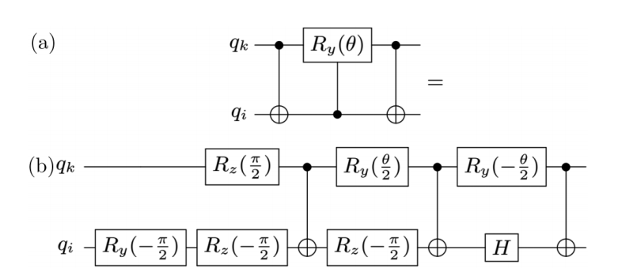
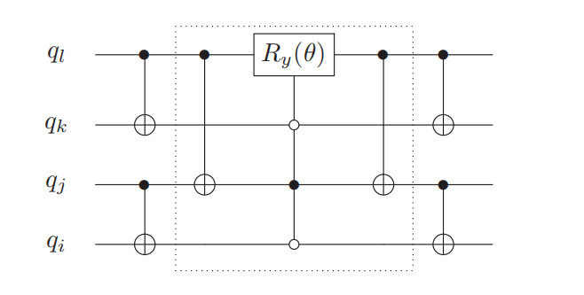

# 
Qubit Unitary Coupled-Cluster (qUCC) ansatz 

## 1. Introduction

Qubit Unitary Coupled-Cluster (qUCC) ansatz is a variant of unitary coupled-cluster ansatz which uses qubit excitation operators instead of Fermion excitation operators. The Fock space spanned by qubit excitation operators is equivalent as Fermion operators, therefore the exact wave function can be approximated using qubit excitation operators at the expense of a higher order of Trotterization. 

The greatest advantange of qUCC is that the number of CNOT gates is much smaller than the original version of UCC, even using a 3rd or 4th order Trotterization. Also, the accuracy is greatly improved despite that the    number of variational parameters is increased

## 2.Formulism

### 2.1 Fermionic excitations

We use the term fermionic excitation to refer to an exponential of *θ*-parametrized fermionic excitation operators. Single and double fermionic excitation operators are defined,
$$
T_{i}^{k}(\theta) \equiv \theta\left(a_{k}^{\dagger} a_{i}-a_{i}^{\dagger} a_{k}\right) \text { and }  \  \ 
T_{i j}^{k l}(\theta) \equiv \theta\left(a_{k}^{\dagger} a_{l}^{\dagger} a_{i} a_{j}-a_{i}^{\dagger} a_{j}^{\dagger} a_{k} a_{l}\right)
$$
 Single and double fermionic excitations are expressed,
$$
U_{k i}^{(\mathrm{sf})}(\theta)=e^{T_{i}^{k}(\theta)} \text { and } \ \ 
U_{k l i j}^{(\mathrm{df})}(\theta)=e^{T_{i j}^{k l}(\theta)}
$$
After Jordan-Winger transformation, the single excitations are re-expressed,
$$
\begin{aligned}
U_{k i}^{(\mathrm{sf})}(\theta)=& \exp \left[-i \frac{\theta}{2}\left(X_{i} Y_{k}-Y_{i} X_{k}\right) \prod_{r=i+1}^{k-1} Z_{r}\right] \\
=& \exp \left[-i \frac{\theta}{2} X_{i} Y_{k} \prod_{r=i+1}^{k-1} Z_{r}\right] \ \times \exp \left[i \frac{\theta}{2} Y_{i} X_{k} \prod_{r=i+1}^{k-1} Z_{r}\right]
\end{aligned}
$$
the double excitations are re-expressed,
$$
\begin{aligned}
U_{k l i j}^{(\mathrm{df})}(\theta)=& \exp \left[-i \frac{\theta}{8}\left(X_{i} Y_{j} X_{k} X_{l}+Y_{i} X_{j} X_{k} X_{l}\right.\right.\\
&+Y_{i} Y_{j} Y_{k} X_{l}+Y_{i} Y_{j} X_{k} Y_{l}-X_{i} X_{j} Y_{k} X_{l}-X_{i} X_{j} X_{k} Y_{l}\\
&\left.\left.-Y_{i} X_{j} Y_{k} Y_{l}-X_{i} Y_{j} Y_{k} Y_{l}\right) \prod_{r=i+1}^{j-1} Z_{r} \prod_{r^{\prime}=k+1}^{l-1} Z_{r^{\prime}}\right]
\end{aligned}
$$

### 2.2 Qubit excitations

Single- and double-qubit-excitation operators are generated by the qubit annihilation and creation operators,$Q$ and $Q^{\dagger}$,
$$
T_{i}^{k}(\theta) \equiv \theta\left(\hat{Q}_{k}^{\dagger} \hat{Q}_{i}-\hat{Q}_{i}^{\dagger} \hat{Q}_{k}\right) \text { and }  \  \ 
T_{i j}^{k l}(\theta) \equiv \theta\left(\hat{Q}_{k}^{\dagger} \hat{Q}_{l}^{\dagger} \hat{Q}_{i} \hat{Q}_{j}-\hat{Q}_{i}^{\dagger} \hat{Q}_{j}^{\dagger} \hat{Q}_{k} \hat{Q}_{l}\right)
$$
where
$$
\begin{array}{l}
\hat{Q}^{\dagger}=|1\rangle\langle 0|=\frac{1}{2}(X-i Y) \\
\hat{Q} =|0\rangle\langle 1|=\frac{1}{2}(X+i Y)
\end{array}
$$

#### 2.2.1 Single qubit excitations*

A single qubit excitation  can be re-expressed,
$$
U_{k i}^{(\mathrm{sq})}(\theta)= \exp \left[-i \frac{\theta}{2}\left(X_{i} Y_{k}-Y_{i} X_{k}\right) \right]
$$

    

     FIG.1 A circuit performing the single qubit excitation
    

#### 2.2.2 Double qubit excitations

A double qubit excitation can be re-expressed,
$$
\begin{aligned}
U_{k l i j}^{(\mathrm{dq})}(\theta)=& \exp \left[-i \frac{\theta}{8}\left(X_{i} Y_{j} X_{k} X_{l}+Y_{i} X_{j} X_{k} X_{l}\right.\right.+Y_{i} Y_{j} Y_{k} X_{l}+Y_{i} Y_{j} X_{k} Y_{l}-X_{i} X_{j} Y_{k} X_{l}-X_{i} X_{j} X_{k} Y_{l}\\
&\left.\left.-Y_{i} X_{j} Y_{k} Y_{l}-X_{i} Y_{j} Y_{k} Y_{l}\right) \right]
\end{aligned}
$$

    

     FIG.2 A circuit performing a double qubit excitation
    

## 3 Reference

[1] Yordanov, Yordan S.; Arvidsson-Shukur, David R. M.; Barnes, Crispin H. W. (2020): Efficient quantum circuits for quantum computational chemistry. In Phys. Rev. A 102 (6), p. 62612. https://link.aps.org/doi/10.1103/PhysRevA.102.062612