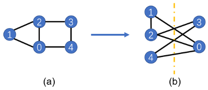

# 使用量子组合优化算法求解Max-Cut问题
量子近似优化算法（quantum approximate optimization algorithm, QAOA）是可以在近期含噪中等规模量子（noisy intermediate-scale quantum, NISQ）设备上运行同时有广泛应用前景的量子算法，其目的是近似地求解组合优化问题。近年来，尽管量子计算机比特数量在逐年增加，但对于现实中成千上万变量的组合优化问题而言仍显不足。为了应对这种场景，解决方案是将大问题分解成能适配量子计算机规模的子问题，然后使用QAOA依次处理子问题得到最终解。

## 背景
现在，假设你是“移山计划”发动机建设总工程师，已经建好了N座发动机，在使用过程中，为了保证持续性，我们需要分两批运行发动机，而且由于工程原因，在第一批发动机运行后与之相关联的发动机在第二批运行时，会产生额外的增益。为了最大化动力，你需要精细地分配这两批发动机，使得这两批之间的增益最大化。

你所能使用的工具只有550A初代量子计算机，它只有15个量子比特但是对QAOA任务执行非常高效，请使用550A来解决你面临的问题吧！

如果使用图的观点，把N座发动机作为N个节点，而相连接的边代表这两座发动机会有关联，如果分配到不同组分批运行，会产生额外增益，因此你需要选择两组节点，使得两组之间连接的边数目最大，也就使得额外增益最大。

## 最大割问题

Max-cut问题数学描述如下，$Z_i$代表第i个节点，取值为+1或者-1，+1的节点们被分到了同一组，而-1的节点组成另一组。两组之间的边连接数则为：

 

让我们考虑用一台15比特的量子设备求解N顶点图的Max-cut问题，要求设计合适的方案，对分解后的子问题限制使用QAOA算法进行求解，同时量子线路的比特数限制在15比特及以内。（使用模拟器求解，不考虑量子设备硬件拓扑）

## 实现

请任意设计修改solve_max_cut.py中的solve函数以实现求解。请确保使用硬件规模N_sub不大于15，同时utils中的工具函数无需修改。

## 分数
求解6张图，包括三种类型分别有稀疏正规图，分块图和稠密图。评分规则为每张图所得到的最后cut除以理论上该图的最大cut，然后乘上图顶点N作为权重作为分数：

$Mean[\sum_{G} \frac{cut}{maxcut}\times N]$
- 对每张图都运行20次取平均值作为乘积
- 如果分数一样依据总运行时间进行排名

### 数据集
- 已知max-cut的图，存在graph文件夹中txt文件里，每张图的存储方式如下：

节点数n  边数m

第一条边所连接的第一个顶点   所连接的第二个顶点

第二条边所连接的第一个顶点   所连接的第二个顶点

......

## 样例代码
无论是最大割或者最小割问题，优化目标函数均为QUBO（Quadratic unconstrained binary optimization）形式，即求解QUBO问题。在样例代码中，我们会循环调用QAOA求解器求解subQUBO问题，具体步骤如下：
1. 首先，随机初始化解。
2. 按照变量对目标函数的影响大小进行排序，将影响最大的15个变量抽取出来而其他的变量维持固定。
3. 对这15个变量形成的子问题（subQUBO问题）利用QAOA求解器高效求解。
4. 回到第2步反复迭代直至收敛。

## 判题程序
请按照指定的数据格式进行输出，判题系统会使用同样的判题程序score.py

## 要求
1. 仅允许在分解选取子问题过程中使用经典算法，不可使用经典算法进行subQUBO问题的求解。
2. 子问题仅可使用QAOA求解。
3. 程序总运行时间在1h内。（需调用qupack中的QAOA模拟器进行子问题求解）
4. 所使用库可通过pip或者conda安装，不使用收费库。
5. 每个参与者或每组不可重复提交。